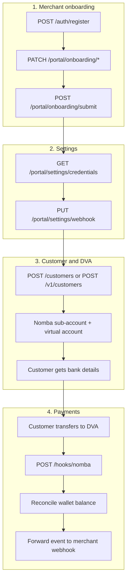
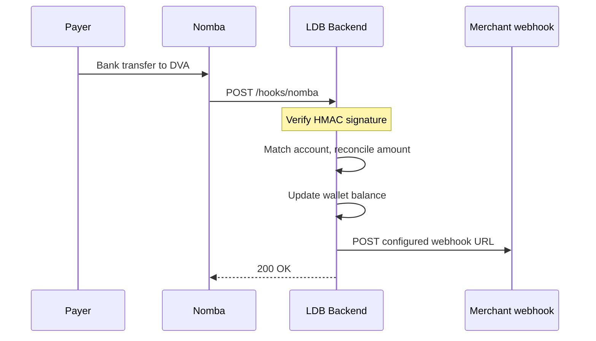

# API Flow Guide

Step-by-step guide for integrating with the LDB DVA backend. For interactive exploration, use [Swagger UI](http://localhost:8070/docs) when the server is running.

---

## Authentication

Two auth modes depending on who is calling:

| Caller | Method | Header / cookie |
|--------|--------|-----------------|
| Dashboard (portal) | Session JWT | Cookie `ldb_session` (set by `/auth/register` or `/auth/login`) |
| Developer / server integrations | API key | `Authorization: Bearer ldb_test_…` or `ldb_live_…` |

Portal routes accept **either** the session cookie or a Bearer API key.

While status is **`pending_kyb`** (before KYB submit), only these portal routes work:
- `/auth/me`
- `/portal/onboarding/*`

Dashboard, settings, customers, transactions, file uploads, and simulate endpoints return **403** until KYB is submitted.

Developer routes (`/customers`, `/accounts`, `/v1/*`, `/webhooks/register`) require a Bearer API key and merchant status **`active`**. Submitting KYB auto-activates the account.

---

## API flow overview



---

## Step 1 — Register and sign in

### 1.1 Register

```http
POST /auth/register
Content-Type: application/json

{
  "full_name": "Amara Olu",
  "email": "amara@example.com",
  "password": "secure-password"
}
```

- Creates a merchant (`status: pending_kyb`)
- Issues a default API key (shown **once** in the response — store it)
- Sets the `ldb_session` cookie for portal routes

### 1.2 Login (returning users)

```http
POST /auth/login
Content-Type: application/json

{
  "email": "amara@example.com",
  "password": "secure-password"
}
```

### 1.3 Current user

```http
GET /auth/me
Cookie: ldb_session=...
```

### 1.4 Logout

```http
POST /auth/logout
Cookie: ldb_session=...
```

---

## Step 2 — KYB onboarding (portal)

All steps require portal auth (session cookie or Bearer key). Data is stored on `merchants.kyb_data`.

| Step | Endpoint | Method | Purpose |
|------|----------|--------|---------|
| Business | `/portal/onboarding/business` | PATCH | Business name, registration, industry |
| Address | `/portal/onboarding/address` | PATCH | Address, phone, website |
| Verification | `/portal/onboarding/verification` | PATCH | Director name, BVN, document URLs, consent |
| Documents | `/portal/onboarding/documents` | POST | Upload CAC / proof files (multipart) |
| Submit | `/portal/onboarding/submit` | POST | Complete KYB and activate account |
| Status | `/portal/onboarding/status` | GET | Checklist and current KYB state |

### Document upload

```http
POST /portal/onboarding/documents
Cookie: ldb_session=...
Content-Type: multipart/form-data

document_type=cac_certificate
file=<PDF or image, max 10MB>
```

Files are stored in Cloudinary; metadata is saved in `kyb_data.documents`.

### Submit KYB

```http
POST /portal/onboarding/submit
```

Requires `business`, `address`, and `verification` steps to be completed first.

On success:
- Sets `status` to **`active`** (auto-approved)
- Sets `kyb_data.submitted_at` and `kyb_data.approved_at`
- Unlocks dashboard, settings, developer API, and all other portal routes

Calling submit again when already active returns **422** `"KYB onboarding already completed"`.

---

## Step 3 — Portal settings

Requires **`active`** merchant status (available after KYB submit).

| Endpoint | Method | Purpose |
|----------|--------|---------|
| `/portal/settings/credentials` | GET | List API key prefixes |
| `/portal/settings/credentials/rotate` | POST | Rotate secret key (new key returned once) |
| `/portal/settings/webhook` | GET | Outbound webhook URL and events |
| `/portal/settings/webhook` | PUT | Set webhook URL and subscribed events |
| `/portal/settings/webhook/test` | POST | Send a test payload to your webhook |

**Webhook test troubleshooting**

- Use **POST** with portal auth (`ldb_session` cookie or Bearer API key).
- Merchant must be **`active`** (complete KYB submit first).
- Save the webhook first via `PUT /portal/settings/webhook`.
- Your receiver URL must be **publicly reachable** from the API server (not `localhost` or a private LAN IP).
- The API returns `delivered: true` only if your endpoint responds with HTTP 2xx. Otherwise check `data.reason` and `data.attempts` for the URL, status code, or connection error.
- Test payload shape:

```json
{
  "event": "wallet.credited",
  "data": {
    "customerId": "demo-customer",
    "amountReceived": "60000",
    "transactionRef": "TXN-DEMO-TEST"
  }
}
```

- Verify with header `X-LDB-Signature` (HMAC-SHA256 of the raw JSON body using your webhook secret).
| `/portal/settings/profile` | GET / PATCH | Merchant profile |
| `/portal/settings/security/password` | POST | Change dashboard password |

### Outbound webhook events

- `customer.payment_received`
- `wallet.credited`
- `payment.partial`
- `payment.misdirected`
- `transfer.received`
- `account.created`
- `reconciliation.flagged`

---

## Step 4 — Dashboard (portal read APIs)

Requires **`active`** merchant status. Portal auth required.

| Endpoint | Purpose |
|----------|---------|
| `GET /portal/dashboard/summary` | High-level counts and balances |
| `GET /portal/customers` | List customers |
| `GET /portal/customers/{id}` | Customer detail |
| `GET /portal/customers/{id}/statement` | Customer statement |
| `GET /portal/transactions` | All transactions |
| `GET /portal/transactions/summary` | Aggregates |
| `GET /portal/transactions/recent` | Recent activity |
| `POST /portal/simulate-transfer` | Simulate inbound transfer (sandbox) |

Alias for simulate: `POST /webhooks/dva-funding` (same handler, no portal prefix).

---

## Step 5 — Create a customer and DVA (developer API)

Requires **`Authorization: Bearer <api_key>`** and merchant status **`active`**.

### Option A — REST (`/customers`)

```http
POST /customers
Authorization: Bearer ldb_test_...
Content-Type: application/json

{
  "name": "Jane Doe",
  "email": "jane@example.com",
  "phone": "+2348012345678",
  "target_amount": "100000.00",
  "metadata": {}
}
```

**What happens:**

1. Customer row created for the merchant
2. Nomba sub-account created (per customer)
3. Dedicated virtual account provisioned on Nomba
4. Bank account details returned in the response

If Nomba provisioning fails partially, the customer may remain `pending_nomba`. Retry with:

```http
POST /customers/{customer_id}/link-nomba-sub-account
```

### Option B — Versioned API (`/v1`)

Same operations under `/v1/customers` and `/v1/webhooks` for integrators who prefer a versioned surface.

### Dedicated account (direct)

If you already have a customer without an account:

```http
POST /accounts/dedicated
Authorization: Bearer ldb_test_...

{
  "customer_id": "<uuid>",
  "account_name": "Jane Doe"
}
```

### Read account data

| Endpoint | Purpose |
|----------|---------|
| `GET /accounts/{account_id}` | Account details |
| `GET /accounts/{account_id}/transactions` | Paginated transactions |
| `GET /accounts/{account_id}/statement` | Statement |
| `GET /customers/{customer_id}` | Customer profile |
| `PATCH /customers/{customer_id}` | Update customer |

---

## Step 6 — Payment and webhook flow



### Inbound — Nomba → LDB

```http
POST /hooks/nomba
nomba-signature: ...
nomba-timestamp: 2025-09-29T10:51:44Z
Content-Type: application/json
```

Configure `NOMBA_WEBHOOK_SECRET` with the **webhook signature key** from the Nomba dashboard (Developer → Webhook Setup). This is not the same as `NOMBA_CLIENT_SECRET`.

LDB verifies each webhook by building a canonical signing string from the JSON payload and the `nomba-timestamp` header:

```
{event_type}:{requestId}:{merchant.userId}:{merchant.walletId}:{transaction.transactionId}:{transaction.type}:{transaction.time}:{transaction.responseCode}:{nomba-timestamp}
```

Then: `base64(HMAC-SHA256(NOMBA_WEBHOOK_SECRET, canonical_string))`, compared case-insensitively to `nomba-signature` (or `nomba-sig-value`).

Nomba sends `payment_success` events for virtual account transfers; LDB deduplicates by `requestId`, credits the customer wallet, and triggers outbound events.

### Outbound — LDB → your server

Register your URL via portal settings or:

```http
POST /webhooks/register
Authorization: Bearer ldb_test_...

{
  "url": "https://your-app.com/webhooks/ldb",
  "events": ["wallet.credited", "payment.partial"]
}
```

### Sandbox simulate (no real transfer)

```http
POST /hooks/simulate
Authorization: Bearer ldb_test_...

{
  "account_number": "1234567890",
  "amount": "50000.00",
  "sender_name": "Test Payer"
}
```

Or portal: `POST /portal/simulate-transfer`.

---

## Step 7 — File uploads (portal)

Generic Cloudinary uploads (KYB or other portal assets):

| Endpoint | Method | Purpose |
|----------|--------|---------|
| `/portal/files/upload` | POST | Single file |
| `/portal/files/upload/multiple` | POST | Up to 10 files |
| `/portal/files/{public_id}` | DELETE | Remove file |
| `/portal/files/{public_id}/info` | GET | File metadata |

Portal auth required. Allowed types: PDF, JPEG, PNG, GIF, WebP (max 10MB).

---

## Other endpoints

| Endpoint | Auth | Purpose |
|----------|------|---------|
| `GET /health` | None | Health check |
| `POST /merchants/register` | None | Legacy merchant registration (API key only, no session) |
| `GET /merchants/me` | Bearer | Merchant profile via API key |
| `GET /metrics` | None | Prometheus metrics |

---

## Response format

Success:

```json
{
  "status": "success",
  "status_code": 201,
  "message": "Customer created",
  "data": { }
}
```

Error:

```json
{
  "status": "failure",
  "status_code": 401,
  "message": "Unauthorized access"
}
```

---

## Quick start checklist

1. `POST /auth/register` — save API key and session cookie  
2. Complete KYB via `/portal/onboarding/*` and `POST /portal/onboarding/submit` (auto-activates account)  
3. `PUT /portal/settings/webhook` — set your webhook URL  
4. `POST /customers` — create customer + DVA  
5. Share bank details with the end customer  
6. Configure Nomba sandbox webhook → `https://your-api/hooks/nomba`  
7. Test with `POST /portal/simulate-transfer` or a real sandbox transfer  
8. Receive outbound events on your webhook URL  
